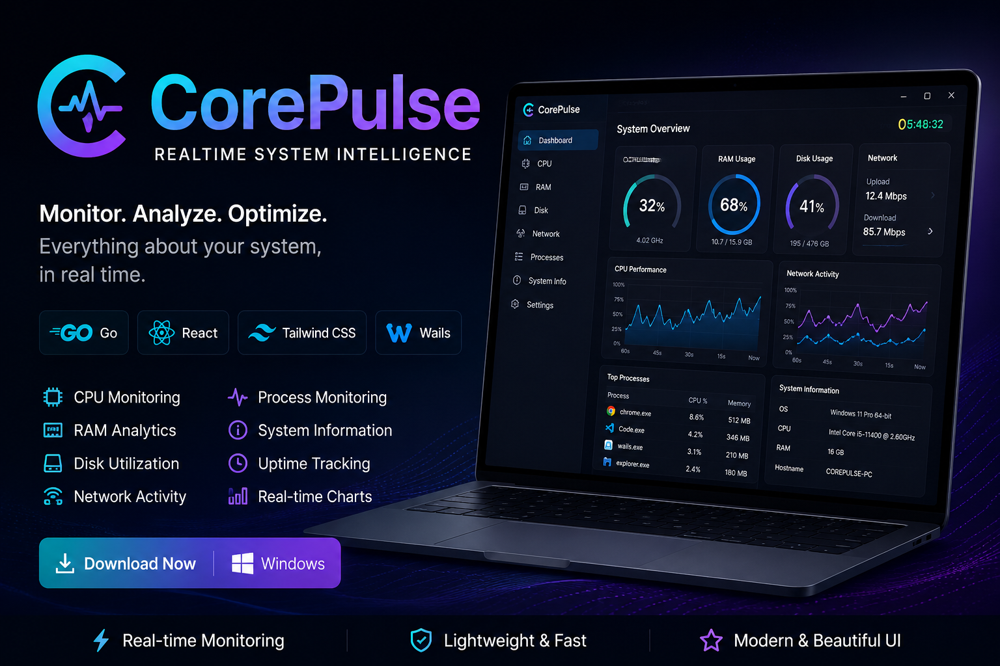
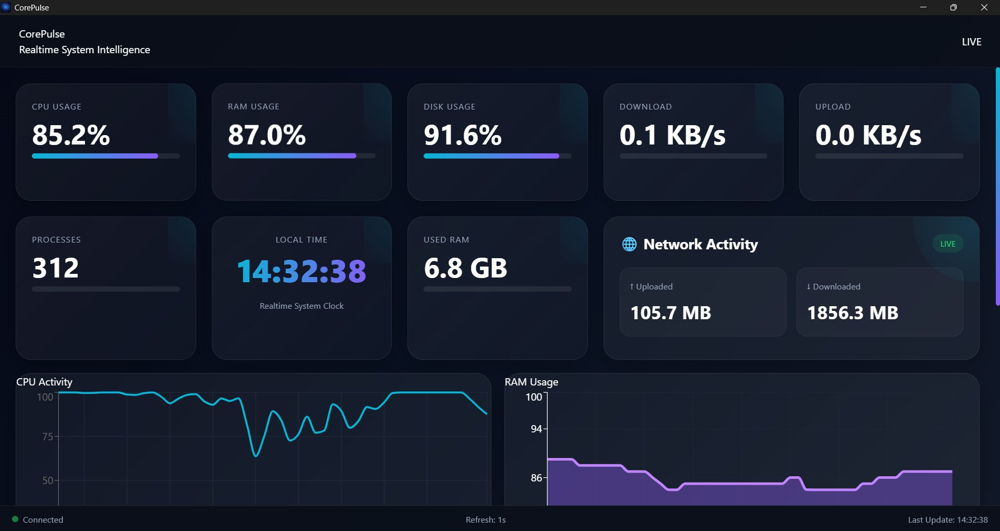

# CorePulse

Real-Time System Intelligence Dashboard for Windows

## Overview

CorePulse is a lightweight desktop application built with:

- Wails
- React
- Go
- Tailwind CSS

It provides real-time monitoring of system performance and hardware statistics through a modern glassmorphism dashboard.

---

## Features

### Real-Time Monitoring

- CPU Usage
- RAM Usage
- Disk Usage
- Active Processes
- System Uptime

### Network Analytics

- Upload Speed
- Download Speed
- Total Uploaded Data
- Total Downloaded Data

### Live Charts

- CPU Activity Graph
- RAM Usage Graph

### System Information

- Hostname
- Operating System
- Platform
- CPU Model
- CPU Core Count
- Total RAM
- Used RAM
- Disk Information

### Modern Interface

- Glassmorphism UI
- Realtime Updates
- Responsive Layout
- Lightweight Performance

---

## Screenshots

### Dashboard

---
## 📥 Installation

You can download CorePulse using either of the following methods:

### 🔹 Official Website (Recommended)
Download the latest version directly from the official website:
👉 https://sridhar725s.github.io/CorePulse/

---

### 🔹 GitHub Releases
Alternatively, you can download the latest installer from GitHub:

👉 https://github.com/Sridhar725S/CorePulse/releases/tag/v1.0.0

After downloading, run the installer:

CorePulse_Setup_v1.0.0.exe

---

## Development

### Clone

git clone https://github.com/Sridhar725S/CorePulse.git

### Frontend

cd frontend
npm install

### Backend

go mod tidy

### Run

wails dev

### Build

wails build

---

## Tech Stack

Frontend

- React
- TailwindCSS
- Recharts

Backend

- Go
- gopsutil

Desktop Framework

- Wails v2

---

## Future Roadmap

- GPU Monitoring
- Temperature Monitoring
- Network Diagnostics
- Process Manager
- Export Reports
- Dark / Light Themes
- Performance Alerts

---

## License

MIT License

---

## Author

Sridhar S

Built with Go + React + Wails
